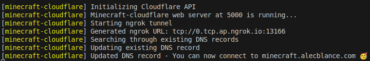

# Minecraft Cloudflare ☁️

Minecraft Cloudflare exposes your Minecraft server to the public without portforwarding using Cloudflare and ngrok. It automatically updates your Cloudflare's DNS record (SRV) to point to the newly generated url of ngrok.



## Run locally

> **Note**
> Make sure you have Node preinstalled

1. Create your `.env` from [.env.example](https://github.com/AlecBlance/minecraft-cloudflare/blob/main/.env.example)

2. Install all the dependencies

```bash
npm install
```

3. Run the application

```bash
npm run build-start
```

## Run on Docker Compose

Please see the [docker-compose.yml](https://github.com/AlecBlance/minecraft-cloudflare/blob/main/docker-compose.yml) as an example.

```yml
services:
  minecraft-cloudflare:
    image: alecblance/minecraft-cloudflare:1.1.1
    container_name: minecraft-cloudflare
    ports:
      - 5000:5000
    environment:
      - NGROK_AUTH_TOKEN=${NGROK_AUTH_TOKEN}
      - MINECRAFT_SERVER_PORT=${MINECRAFT_SERVER_PORT}
      - CLOUDFLARE_API_KEY=${CLOUDFLARE_API_KEY}
      - CLOUDFLARE_ZONE_ID=${CLOUDFLARE_ZONE_ID}
      - CLOUDFLARE_EMAIL=${CLOUDFLARE_EMAIL}
      - SUBDOMAIN_TO_UPDATE=${SUBDOMAIN_TO_UPDATE}
      - MINECRAFT_CLOUDFLARE_SERVER_PORT=${MINECRAFT_CLOUDFLARE_SERVER_PORT}
    restart: unless-stopped
```

## FAQ

#### How does it work?

It runs ngrok which forwards the ip:port or just port of the Minecraft server, then extracts the url and edits the SRV of your Cloudflare zone. It is actually simple, yet a boring manual task if you do restarts 😮‍💨.

#### Why did you make this?

I was planning to host a minecraft server, but we don't have an option to do portforwarding. Having knowledge on Cloudflare tunnels, I thought it will just be a breeze, however it doesn't support minecraft's tcp so we are forced to use ngrok. Manually changing records is tiresome, so why not create another docker container that automates these. 🥹✨

#### Are you open to suggestions?

Well, of course! 😎 Feel free to contact me or do a PR. I'll review it and if it is good and valuable, I'll merge it right away.

## Tech Stack

**Client:** NodeJS

**Libraries:** cloudflare, ngrok

## Authors

- [@AlecBlance](https://www.github.com/AlecBlance)

## License

[MIT](LICENSE)
